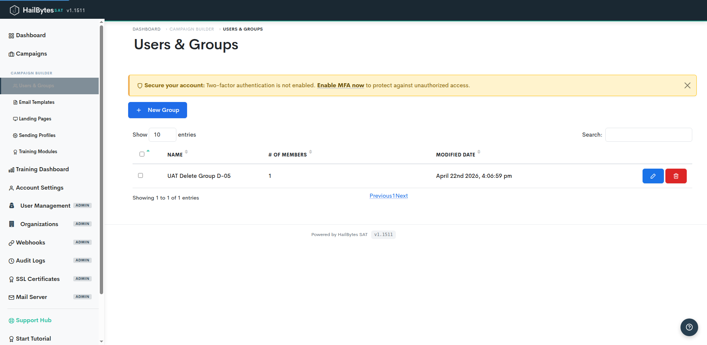
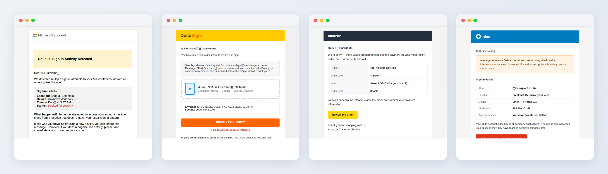
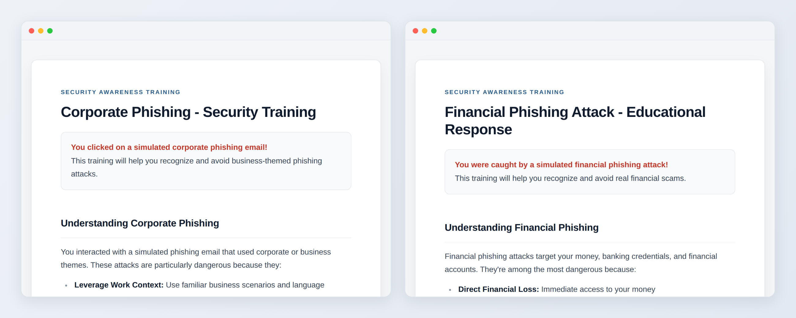
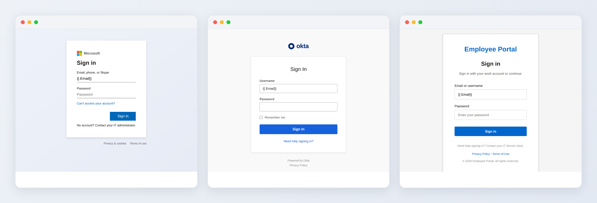
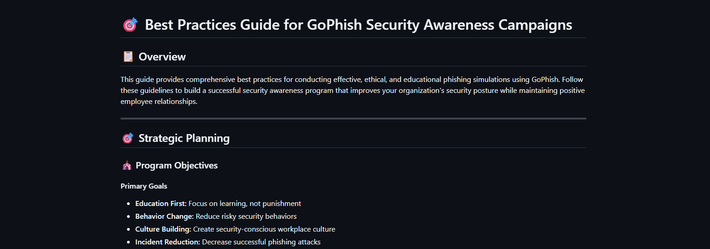
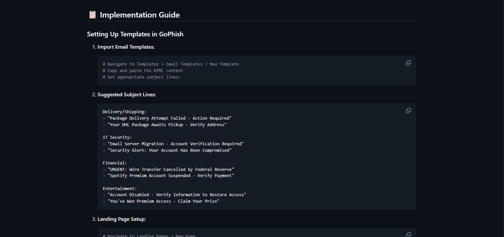
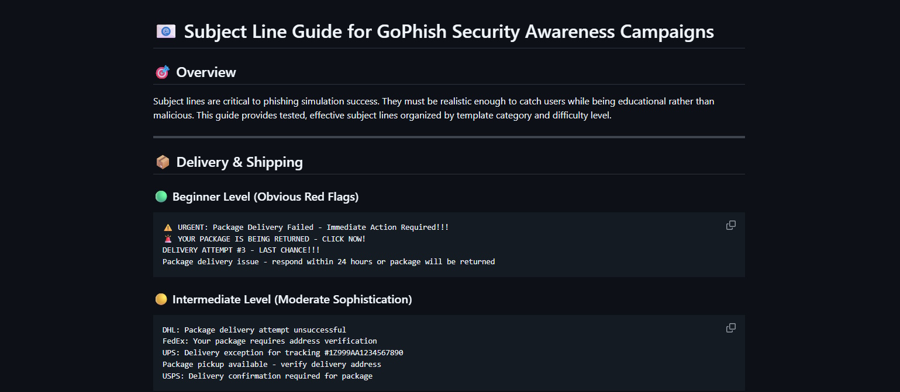

# GoPhish Training Templates

[](https://github.com/HailBytes/gophish-training-templates)
[](https://getgophish.com/)
[](LICENSE)
[](https://hailbytes.com/sat?utm_source=github&utm_medium=repo_readme&utm_campaign=gophish-training-templates&utm_content=badge)

A comprehensive collection of professionally designed email templates and landing pages for conducting effective employee security awareness phishing simulation campaigns using the GoPhish framework.

---

## Deploy These in 5 Minutes with HailBytes SAT

<p align="center">
  
</p>

Running GoPhish yourself means managing infrastructure, maintaining sending profiles, exporting CSVs to track metrics, and stitching together your own reporting. **HailBytes SAT** gives you all of these templates pre-loaded in a fully managed security awareness training environment — deployed inside your own AWS or Azure account (BYOC) so your data never leaves your cloud.

HailBytes SAT is built for teams that need results without the ops overhead: a hardened enterprise platform, a live metrics dashboard, multi-tenant MSSP support, and compliance documentation (SOC 2 roadmap, NIST CSF mapping) included. Whether you run one campaign a quarter or manage phishing programs for dozens of clients, SAT scales without additional infrastructure work on your end.

<p align="center">
  <a href="https://aws.amazon.com/marketplace/search/results?searchTerms=hailbytes+sat&utm_source=github&utm_medium=repo_readme&utm_campaign=gophish-training-templates&utm_content=aws_cta_button">
    
  </a>
  &nbsp;&nbsp;
  <a href="https://azuremarketplace.microsoft.com/en-us/marketplace/apps?search=hailbytes+sat&utm_source=github&utm_medium=repo_readme&utm_campaign=gophish-training-templates&utm_content=azure_cta_button">
    
  </a>
</p>

### Self-host vs. HailBytes SAT — At a Glance

| Capability | Self-host GoPhish (this repo) | HailBytes SAT (managed) |
|---|---|---|
| Templates | ✅ This repo | ✅ This repo + additional packs |
| Hosting | You manage | BYOC in your AWS / Azure |
| Metrics dashboard | DIY (CSV exports) | Built-in (click rate, report rate, time-to-report, repeat offenders) |
| Compliance docs | DIY | Provided (SOC 2 roadmap, NIST CSF mapping) |
| MSSP multi-tenant | DIY | Built-in |
| Support | Community (GitHub Issues) | Enterprise SLA |

---

## What's Included


<div align="center">
  
</div>

### Email Templates (91 Templates Across 27 Industries)

> 📖 **[Browse the full template catalog →](docs/CATALOG.md)** — an auto-generated index of every template with its attack vector, difficulty, and estimated click rate.

- Realistic phishing scenarios mimicking common attack vectors
- Corporate communication themes (IT updates, HR notifications, security alerts)
- Social engineering templates (delivery notifications, account suspensions, payment alerts)
- Entertainment platform impersonations (Spotify, Starbucks)
- Financial service attacks (banking, wire transfers, payment confirmations)
- Cloud service phishing (Dropbox, Google Drive, Office 365)
- **Healthcare**: HIPAA compliance, patient portals, insurance verification
- **Education**: Student portals, financial aid, academic systems
- **Manufacturing**: Supplier portals, vendor compliance, supply chain
- **Legal**: Case management, confidential document sharing
- **HR/Payroll**: Benefits enrollment, direct deposit, payroll systems
- **Technology/SaaS**: API keys, developer portals, system updates
- **Retail**: Loyalty programs, customer accounts, inventory systems
- **Hospitality**: Hotel reservations, loyalty programs, booking systems
- **Utilities**: Billing credits, service notifications, account management
- **LATAM / Portuguese**: Banking alerts, IT helpdesk, HR onboarding, government (Brazil)
- **LATAM / Spanish**: Microsoft 365, banking alerts, IT helpdesk, tax authority (SAT)
- Multi-industry coverage for comprehensive training programs


<div align="center">
  
</div>

### Educational Modules
- Immediate learning opportunities after simulation clicks
- Category-specific training tailored to attack types
- Interactive quizzes to reinforce learning
- Real-world statistics and impact data
- Actionable protection strategies employees can implement
- Progressive difficulty levels for ongoing education


<div align="center">
  
</div>

### Landing Pages
- Credential harvesting pages for testing user behavior
- Educational notification pages for immediate training
- Mobile-optimized responsive designs for all devices
- Professional, realistic appearance to maximize effectiveness
- Instant educational value rather than just "gotcha" moments

## Features

### Ready-to-Deploy
- Drop-in templates requiring minimal configuration
- Modern GoPhish syntax with proper template variables
- Mobile-responsive design for all screen sizes


<div align="center">
  
</div>

### Industry Best Practices
- Based on real-world attack patterns and methodologies
- Updated for 2024/2025 threat landscape
- Professional design matching legitimate services

### Compliance & Ethics Focused
- Designed with privacy and legal considerations
- Educational focus over punitive measures
- Immediate learning opportunities for participants

### Highly Customizable
- Easy branding modifications for your organization
- Configurable difficulty levels and scenarios
- Modular design for mixing and matching components

## Repository Structure

```
gophish-training-templates/
│   # Each category folder holds its email templates plus a metadata.json,
│   # a generated README.md, and (where applicable) an education/ training page.
│
├── ai-tools/            # (2)  AI tool impersonations (Copilot, ChatGPT)
├── cloud-services/      # (2)  Cloud storage & file sharing (Dropbox, Drive)
├── collaboration/       # (3)  Collaboration apps (Slack, Teams, Zoom)
├── corporate/           # (3)  Corporate news, travel, internal comms
├── delivery-shipping/   # (3)  Package delivery & shipping notices
├── e-signature/         # (2)  E-signature platforms (DocuSign, Adobe Sign)
├── education/           # (2)  Student portals, financial aid
├── entertainment/       # (2)  Entertainment & rewards (Spotify, Starbucks)
├── financial/           # (2)  Banking, wire transfers, payments
├── government/          # (4)  Government & regulatory agency lures
├── healthcare/          # (3)  HIPAA, patient portals, insurance
├── hospitality/         # (3)  Hotel & travel booking services
├── hr-payroll/          # (4)  HR & payroll (benefits, direct deposit)
├── identity/            # (3)  Identity providers & SSO (Okta, Duo)
├── it-security/         # (6)  Internal IT department communications
├── itsm/                # (3)  IT Service Management (ServiceNow, Jira)
├── latam-portuguese/    # (5)  Portuguese-language templates (Brazil)
├── latam-spanish/       # (4)  Spanish-language templates (LATAM)
├── legal/               # (3)  Legal authority & litigation pretexts
├── manufacturing/       # (3)  Supply-chain & vendor portals
├── microsoft/           # (6)  Microsoft products & services
├── quishing/            # (6)  QR-code phishing (quishing)
├── retail/              # (3)  Retail brands & loyalty programs
├── smishing/            # (5)  SMS phishing (smishing)
├── social-media/        # (3)  Social & professional networks (LinkedIn, Instagram)
├── technology/          # (3)  Developer & technical staff (API keys, cloud consoles)
├── utilities/           # (3)  Utility billing & disconnection notices
│
├── landing-pages/       # Credential-capture & post-click training pages
├── campaign-guides/     # Implementation, subject-line, best-practice & benchmarking guides
├── docs/                # Catalog, metrics guide, lure audit, showcase images
├── tools/               # Catalog/README generators, validator, preview & import scripts
└── tests/               # Tests for the tooling
```

> 📁 **Every category folder has its own `README.md`** listing the templates it contains, their attack vector and estimated click rate, suggested subject lines, the paired training page, and operator notes. For the complete cross-category index, see the **[template catalog](docs/CATALOG.md)**.

## Quick Start Guide

### Prerequisites
- GoPhish server installation
- Administrative access to GoPhish interface
- Basic understanding of phishing simulation concepts

### Installation Steps

1. **Clone the Repository**
   ```bash
   git clone https://github.com/hailbytes/gophish-training-templates.git
   cd gophish-training-templates
   ```

2. **Import Email Templates**
   ```bash
   # Navigate to GoPhish Admin Panel
   # Go to Templates > Email Templates > New Template
   # Copy and paste HTML content from desired template
   # Configure subject line (see subject-lines.md for suggestions)
   ```

3. **Set Up Landing Pages**
   ```bash
   # Go to Landing Pages > New Page
   # Import HTML from landing-pages/ directory
   # Configure credential capture settings if using harvest pages
   ```

4. **Create User Groups**
   ```bash
   # Go to Users & Groups > New Group
   # Import your employee list
   # Segment by department or risk level for targeted campaigns
   ```

5. **Launch Your First Campaign**
   ```bash
   # Go to Campaigns > New Campaign
   # Select appropriate template and landing page
   # Configure sending profile with realistic sender
   # Schedule during business hours for maximum realism
   ```

## Campaign Types Supported

### Baseline Testing
Establish current security awareness levels across your organization
- **Recommended Templates:** IT Security, Delivery notifications
- **Frequency:** Quarterly
- **Target:** All employees

### Department-Specific Training
Focus on risks relevant to specific roles and departments
- **IT Department:** Advanced technical phishing, software updates, API security
- **Finance Team:** Wire transfer scams, payment confirmations, invoice fraud
- **HR Personnel:** Benefits enrollment, payroll updates, employee verification
- **Healthcare Workers:** HIPAA compliance, patient portal security, insurance verification
- **Legal Teams:** Case management, confidential document sharing
- **Manufacturing/Supply Chain:** Vendor portals, supplier compliance
- **Customer Service:** Account verification, loyalty programs
- **General Staff:** Social media, entertainment, delivery scams
- **LATAM / Brazil Teams:** Portuguese-language banking, tax, IT, and HR scenarios

### Progressive Difficulty
Gradually increase sophistication to build resilience
- **Level 1:** Obvious phishing with clear red flags
- **Level 2:** Moderate sophistication with subtle indicators
- **Level 3:** Advanced attacks mimicking legitimate communications
- **Level 4:** Spear phishing with personalized content

### Seasonal Campaigns
Leverage current events and holidays for realistic scenarios
- **Holiday Shopping:** Package delivery, shopping confirmations
- **Tax Season:** IRS / Receita Federal communications, financial services
- **Back-to-School:** Educational platform attacks
- **Year-End:** HR benefits, company announcements

## Educational Approach

### Learning-Focused Design
Every template includes corresponding educational content that:
- Explains why the attack was effective
- Identifies specific red flags users should watch for
- Provides real-world context and statistics
- Offers actionable steps for future protection

### Multi-Modal Learning
- **Visual indicators** highlighting suspicious elements
- **Interactive quizzes** to test comprehension
- **Scenario-based examples** for practical application
- **Progressive disclosure** of information to maintain engagement

### Measurable Outcomes
Track improvement through:
- Click-through rate reduction over time
- Increased reporting of suspicious emails
- User feedback and comprehension scores
- Behavioral change metrics

See [docs/measuring-effectiveness.md](docs/measuring-effectiveness.md) for a detailed guide on which metrics matter and what good looks like.

## Ethical Guidelines & Legal Compliance

### Responsible Use
These templates are designed exclusively for:
- **Authorized security awareness training** within your organization
- **Educational purposes** with proper consent and notification
- **Improving security posture** through awareness and training

### Prohibited Uses
- Unauthorized testing of external organizations
- Malicious attacks or actual credential theft
- Testing without proper legal authorization
- Any activity that violates applicable laws or regulations

### Best Practices
- **Obtain proper authorization** before conducting simulations
- **Ensure compliance** with organizational policies and applicable laws
- **Focus on education** rather than punishment
- **Provide immediate learning opportunities** for participants
- **Maintain confidentiality** of individual results
- **Follow up** with additional training for those who need it

## Contributing

We welcome contributions to improve and expand this template collection!

### How to Contribute
1. **Fork the repository**
2. **Create a feature branch** (`git checkout -b feature/new-template`)
3. **Add your templates** following our naming conventions
4. **Include educational content** for any new attack vectors
5. **Test thoroughly** with GoPhish before submitting
6. **Submit a pull request** with detailed description

### Contribution Guidelines
- **Follow existing naming conventions** and folder structure
- **Include both email templates and educational modules**
- **Ensure mobile responsiveness** for all designs
- **Test with current GoPhish version** before submission
- **Provide realistic, educational content** rather than obvious fake attempts
- **Include suggested subject lines** and implementation notes

### What We Need
- **Additional attack vectors** (new platforms, services, techniques)
- **Industry-specific templates** (healthcare, education, manufacturing)
- **Non-English templates** for international organizations (see `latam-portuguese/` for the pattern)
- **Advanced persistent threat scenarios** for mature security programs
- **Accessibility improvements** for inclusive design

## Additional Resources

### Documentation


<div align="center">
  
</div>

- [Implementation Guide](campaign-guides/implementation-guide.md) - Detailed setup instructions


<div align="center">
  
</div>

- [Subject Line Suggestions](campaign-guides/subject-lines-guide.md) - Proven effective subject lines


<div align="center">
  
</div>

- [Best Practices Guide](campaign-guides/best-practices-guide.md) - Campaign management tips
- [Measuring Effectiveness](docs/measuring-effectiveness.md) - Metrics that matter for phishing simulation programs

### Related Projects
- [GoPhish Official Documentation](https://getgophish.com/documentation/)
- [NIST Cybersecurity Framework](https://www.nist.gov/cyberframework)
- [SANS Security Awareness Roadmap](https://www.sans.org/security-awareness-training/)

### Training Resources
- [Phishing Recognition Quiz](https://phishingquiz.withgoogle.com/)
- [KnowBe4 Security Awareness Training](https://www.knowbe4.com/)
- [CISA Security Awareness Resources](https://www.cisa.gov/topics/cybersecurity-best-practices)

## Success Metrics

### Key Performance Indicators
Track your security awareness program effectiveness:

- **Click Rate Reduction:** Measure decreasing susceptibility over time
- **Reporting Increase:** Monitor growth in suspicious email reports
- **Time to Report:** Track how quickly users report potential threats
- **Repeat Offenders:** Identify users needing additional training
- **Knowledge Retention:** Test comprehension through follow-up assessments

### Benchmark Goals
Industry standard targets for mature security awareness programs:
- **Click Rate:** <5% for sophisticated attacks
- **Reporting Rate:** >80% of suspicious emails reported
- **Response Time:** <1 hour average time to report
- **Training Completion:** >95% completion rate for educational modules

See [docs/measuring-effectiveness.md](docs/measuring-effectiveness.md) for calculation methods and department-level analysis guidance.

## Version History

### v3.0.0 - Current Release
- **Added LATAM/Portuguese template pack** (5 Brazilian enterprise scenarios)
- **Added `/docs/measuring-effectiveness.md`** — metrics guide for SAT programs
- **README restructured** as top-of-funnel asset with HailBytes SAT integration section

### v2.0.0
- **Complete template redesign** with modern GoPhish syntax
- **Added educational modules** for all template categories
- **Mobile-responsive design** for all templates
- **Organized folder structure** for better management
- **Enhanced landing pages** with immediate educational value

### v1.0.0 - Legacy Templates
- Basic HTML templates with limited GoPhish integration
- Simple phishing scenarios without educational components
- Desktop-focused design

## Support & Troubleshooting

### Common Issues
- **Template variables not rendering:** Ensure proper GoPhish syntax
- **Mobile display problems:** Check CSS media queries
- **Landing page capture fails:** Verify form configuration in GoPhish
- **Educational modules not loading:** Check file paths and permissions

### Getting Help
- **Open an issue** on GitHub for bugs or feature requests
- **Check existing issues** before creating new ones
- **Provide detailed information** including GoPhish version and error messages
- **Include screenshots** for visual issues

### Contact
For questions about implementation or customization:
- **Email:** [info@hailbytes.com]
- **GitHub Issues:** [https://github.com/HailBytes/gophish-training-templates/issues]
- **Security Team:** security@hailbytes.com

## License

This project is licensed under the Mozilla Public License 2.0 - see the [LICENSE](LICENSE) file for details.

### MPL 2.0 License Summary
- **Commercial use:** Allowed
- **Modification:** Allowed (with source disclosure requirements)
- **Distribution:** Allowed (with license preservation)
- **Private use:** Allowed
- **Patent use:** Granted (with termination clause for patent litigation)
- **Trademark use:** Not granted
- **Liability:** Limited
- **Warranty:** Limited
- **Copyleft:** File-level (modified files must remain open source)

### Key MPL 2.0 Requirements
- **Source Disclosure:** Modified files must include source code and license notice
- **License Preservation:** MPL 2.0 license must be included with distributions
- **Patent Protection:** Automatic patent license grant for contributors
- **Compatibility:** Can be combined with proprietary code (file-level copyleft)
- **Modifications:** Changes to MPL-licensed files must remain under MPL 2.0

## Acknowledgments

- **GoPhish Team** for creating an excellent phishing simulation platform
- **Security Community** for sharing knowledge and best practices
- **Contributors** who help improve and expand this template collection
- **Organizations** using these templates to build stronger security cultures

---

## Important Disclaimer

**These templates are for authorized security awareness training only.** Always:

- Obtain proper authorization before conducting phishing simulations
- Ensure legal compliance with all applicable laws and regulations
- Focus on education rather than punishment or embarrassment
- Respect privacy and maintain confidentiality of results
- Follow organizational policies for security awareness training

**Unauthorized use of these templates for malicious purposes is strictly prohibited and may violate local, state, and federal laws.**

---

<div align="center">

**Building Security Awareness Through Education**

*Help us improve cybersecurity one simulation at a time*

[Star this repo](../../stargazers) | [Report Bug](../../issues) | [Request Feature](../../issues) | [Contribute](../../pulls)

</div>

---

<div align="center">

### HailBytes SAT — Security Awareness Training for Teams & MSSPs

**[HailBytes SAT](https://hailbytes.com/sat?utm_source=github&utm_medium=repo_readme&utm_campaign=gophish-training-templates&utm_content=footer_banner)** — Enterprise phishing simulation and security awareness training, deployed in your own AWS or Azure account in minutes. All these templates included. Built-in metrics, multi-tenant MSSP support, and enterprise SLA.

[](https://aws.amazon.com/marketplace/search/results?searchTerms=hailbytes+sat&utm_source=github&utm_medium=repo_readme&utm_campaign=gophish-training-templates&utm_content=footer_aws)
[](https://azuremarketplace.microsoft.com/en-us/marketplace/apps?search=hailbytes+sat&utm_source=github&utm_medium=repo_readme&utm_campaign=gophish-training-templates&utm_content=footer_azure)
[](https://hailbytes.com/sat?utm_source=github&utm_medium=repo_readme&utm_campaign=gophish-training-templates&utm_content=footer_hailbytes)

*BYOC architecture · SOC 2 roadmap · NIST CSF mapping · MSSP-ready multi-tenancy · Enterprise SLA*

</div>
